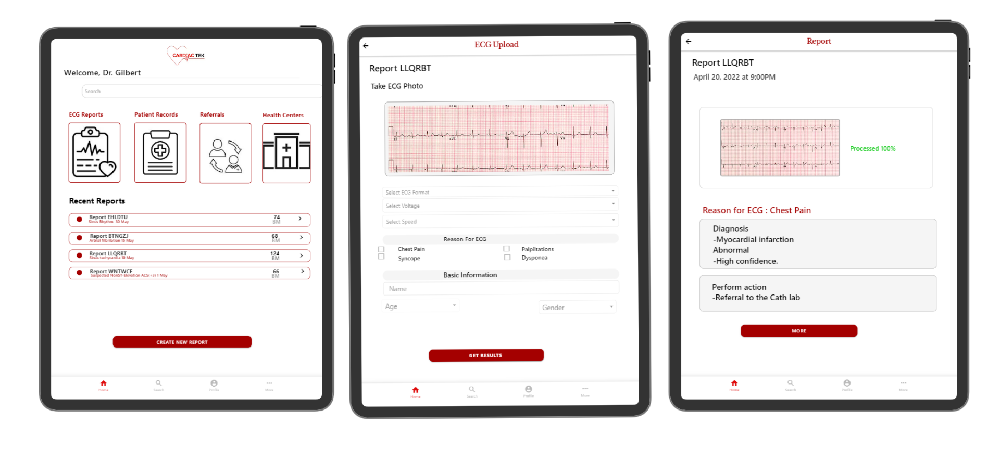

Here’s the complete response with all sections combined, including the revised **Setting up the Environment and Project** and **Deployment Plan** sections:

---

# PROJECT NAME: CardiacTek (ECG Interpretation Software)

A ML deployment app

## Table of Contents

- [Project Description](#project-description)
- [Features](#features)
- [Designs](#designs)
- [Setting up the Environment and Project](#setting-up-the-environment-and-project)
- [Deployment Plan](#deployment-plan)
- [API Development](#api-development)
- [Research on Integration with EHR Systems](#research-on-integration-with-ehr-systems)
- [Link to GitHub Repo](#link-to-github-repo)
- [Video Demo](#video-demo)

## Project Description
CardiacTek is an AI-powered system designed to diagnose Myocardial Infarction (MI) through Electrocardiogram (ECG) image analysis. This project integrates seamlessly into existing Electronic Health Records (EHR) systems, empowering healthcare professionals with timely and accurate diagnostic insights. By leveraging advanced machine learning algorithms, CardiacTek aims to enhance patient care, streamline treatment planning, and improve overall outcomes for individuals at risk of heart attacks.

### Features
- **Real-time ECG Analysis**: Provides instant diagnostic feedback on ECG images.
- **EHR Integration**: Ensures that diagnostic insights are readily accessible within the existing healthcare framework.
- **User-Friendly Interface**: Designed for intuitive navigation and ease of use by healthcare professionals.
- **EHR Integration**: Ensures that diagnostic insights are readily accessible within the existing healthcare framework.
- **Patient Reports**: Generate and view detailed reports for patients based on ECG analysis.
Settings: Customize application settings for user preferences and configurations.
- **API Integration**: Facilitate communication between the front-end and back-end systems for seamless data exchange.
- **Dashboard**: An interactive dashboard for quick access to various functionalities and patient data.
- **Referrals**: Enable healthcare professionals to refer patients to specialists directly through the app.
- **Health Centers**: Access a directory of health centers for patient referrals and consultations.

### Designs


### Setting up the Environment and Project

#### 1. **Setting up the React App**:
   - **Install Node.js**: Download and install from [nodejs.org](https://nodejs.org/).
   - **Create React App**:
     ```bash
     npx create-react-app cardiac-tek
     cd cardiac-tek
     ```
   - **Install Dependencies**:
     ```bash
     npm install axios react-router-dom
     ```

#### 2. **Setting up the API**:
   - **Create Backend**: Use Flask or FastAPI.
   - **Install Libraries**:
     ```bash
     pip install flask flask-cors
     ```
   - **Define API Endpoints** for ECG image uploads and analysis.

---

### Deployment Plan

1. **Deploy React App**:
   - Host on **Vercel**
   - Configure environment variables for backend integration.

2. **Deploy API**:
   - Host on  **AWS**.
   - Verify connectivity between frontend and backend.

3. **Testing**:
   - Conduct testing across devices and browsers.

---

### API Development
The API is designed to ensure seamless integration with the React app:

- **Endpoints**:
  - `POST /api/upload`: Allows users to upload ECG images for analysis.
  - `GET /api/diagnose`: Provides diagnostic results based on uploaded ECG data.

- **Data Handling**:
  - Utilize libraries like `Pandas` and `NumPy` for data processing and `TensorFlow` or `PyTorch` for model inference, ensuring high accuracy and reliability in diagnostics.

### Research on Integration with EHR Systems
I plan to conduct thorough research on integrating CardiacTek with existing EHR systems. This will involve:
- **Exploring EHR APIs**: Understanding the data standards and APIs used by various EHR systems to facilitate data exchange.
- **Data Privacy and Security**: Investigating compliance with health data regulations (like HIPAA) to ensure patient data is protected.
- **Usability Studies**: Gathering feedback from healthcare professionals to refine the integration process and improve user experience.

### **Link to GitHub Repo**: 
[GitHub Repository](https://github.com/Praise-Atadja/Mission_Capstone_Project.git)

### Video Demo
*(Include link or embed video demo showcasing app functionalities, emphasizing seamless navigation and user interaction)*

---

